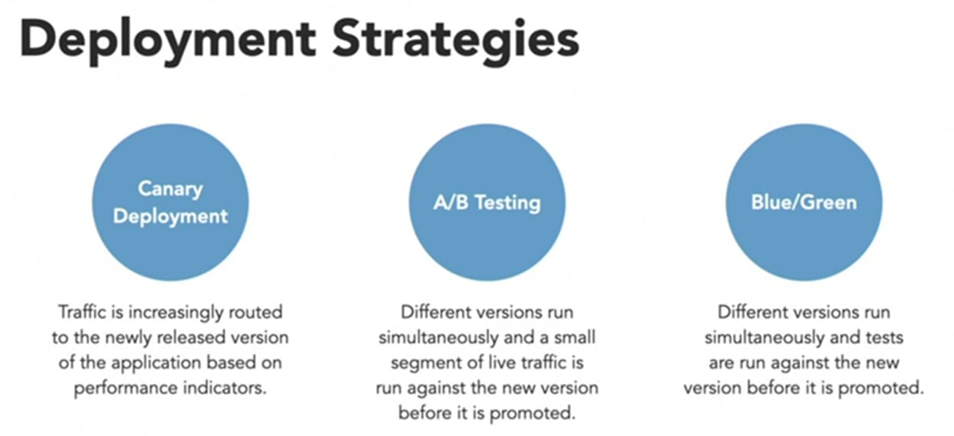

# What is continuous delivery?
> Continuous Delivery (CD) is the process to build, test, configure, and deploy from a build to a production environment. 
> CD by itself is a set of processes, tools, and techniques that enable rapid, reliable, and continuous delivery of software. So CD isn't only about setting up a pipeline, although that part is important. 
- CD is about **setting up a working environment** where:
1. We have a `reliable and repeatable process` for releasing and deploying software.
1. We automate as much as possible.
1. We don't put off doing something that's difficult or painful. Instead, we do it more often so that we figure out how to make it routine.
1. We keep everything in source control.
1. We all agree that **done** means **released**.
1. We build quality into the process. Quality is never an afterthought.
1. We're all responsible for the release process. We no longer work in silos.
1. We always try to improve.
- CD helps software teams deliver reliable software updates to their customers at a rapid cadence. 
- CD also helps ensure that both customers and stakeholders have the latest features and fixes quickly.
- This enables the full the benefits of CD - repeatable builds which are verified in a consistent way across environments.

# Plan a release pipeline
> **Goal**: We already have the build artifact. It's the .zip file that our existing build pipeline creates. But how do we deploy it to a live environment
> A basic CD pipeline contains a `trigger` to get the process going and at least one stage, or deployment phase. 
## What is a pipeline stage?
> A **stage** is a part of the pipeline that can run independently and be triggered by different mechanisms. A mechanism might be the success of the previous stage, a schedule, or even a manual trigger.
> A stage is made up of jobs. A job is a series of steps that defines how to build, test, or deploy your software. Every stage is independent of every other stage. We could have a stage that builds the app and another stage that runs tests. 
## What is an environment?
> You've likely used the term `environment` to refer to where your application or service is running. For example, your production environment might be where your end users access your application.
- Following this example, your production environment might be:
1. A physical machine or virtual machine (VM).
1. A containerized environment, such as Kubernetes.
1. A managed service, such as Azure App Service.
1. A serverless environment, such as Azure Functions.
- An `artifact` is deployed to an environment. 
## How does pipelines perform deployment steps?
- To deploy your software, pipelines first needs to authenticate with the target environment. Pipelines provides different authentication mechanisms. 
- To deploy your app to an Azure resource, such as a virtual machine or App Service, you need a service connection. A service connection provides secure access to your Azure subscription by using one of two methods:
1. Service principal authentication
2. Managed identities for Azure resources

- A **service principal** is an identity with a limited role that can access Azure resources. Think of a service principal as a service account that can do automated tasks on your behalf.
- **Managed identities** for Azure resources are a feature of Azure Active Directory (Azure AD). Managed identities simplify the process of working with service principals. Because managed identities exist on the Azure AD tenant, Azure infrastructure can automatically authenticate the service and manage the account for you.

## What information does pipeline analytics provide?
- Every pipeline provides reports that include metrics, trends, and insights. These reports can help you improve the efficiency of your pipeline.
- Reports include:
1. The overall pass rate of your pipeline.
1. The pass rate of any tests that are run in the pipeline.
1. The average duration of your pipeline runs, including the build tasks, which take the most time to complete.

# Design the pipeline
- When you plan a release pipeline, you usually begin by identifying the stages, or major divisions, of that pipeline. Each stage typically maps to an environment. 
- After you define which stages you need, consider how changes are promoted from one stage to the next. Each stage can define the `success criteria` that must be met before the build can move to the next stage.  As a whole, these approaches are used for `release management`.
## What pipeline stages do you need?
- When you want to implement a release pipeline, it's important to first identify which stages you need. The stages you choose depend on your requirements. 
- When a change is pushed to GitHub, a trigger causes the Build stage to run. The **Build stage** produces a build artifact as its output.
- **Dev stage** should be the first stop for the artifact after it's built. Developers can't always run the entire service from their local development environment. For example, an e-commerce system might require the website, the products database, a payment system, and so on. We need a stage that includes everything the app needs. Setting up a Dev stage would give us an environment where we can integrate the web app with a real database. That database might still hold fictitious data, but it brings us one step closer to our final app.
> We build the app each time we push a change to GitHub. Does that mean each build is promoted to the Dev stage after it finishes?
>> Building continuously gives us important feedback about our build and test health. But we want to promote to the Dev stage only when we merge code into some central branch: either `main or some other release branch`. We can define a `condition` that promotes to the Dev stage only when changes happen on a release branch. 
- The Dev stage runs only when the change happens in the `release` branch. You use a condition to specify this requirement.
- **Test stage** could be the next stop and runs only after the Dev stage succeeds. It can be deployed once a day or on demand to a test environment.
- **Staging stage** could be used to run additional stress tests in a preproduction environment. It can also be used to demo a working application before production deployment. This staging environment is often the last stop before a feature or bug fix reaches our users. Best way to handle promotion would be a release approval. A `release approval` lets you manually promote a change from one stage to the next.
- After management approves the build, we can deploy the build artifact to a **production** environment.
> We can define the criteria that promote changes from one stage to the next. But we've defined some manual criteria in our pipeline. I thought DevOps was about automating everything.
>> DevOps is really about automating repetitive and error-prone tasks. Sometimes human intervention is necessary. For example, we get approval from management before we release new features. As we get more experience with our automated deployments, we can automate more of our manual steps to speed up the process. We can automate additional quality checks in the Test stage so we don't have to approve each build, for example.
- We test only one release at a time. We never change releases in the middle of the pipeline. We use the same release in the Dev stage as in the Staging stage, and every release has its own version number. If the release breaks in one of the stages, we fix it and build it again with a new version number. That new release then goes through the pipeline from the very beginning.
## How do you measure the quality of your release process? 
- Team's design a pipeline that takes their app all the way from build to staging. The whole point of this pipeline isn't just to make their lives easier. It's to ensure the quality of the software they're delivering to their customers.
- The quality of your release process can't be measured directly. What you can measure is how well your process works. If you're constantly changing the process, this might be an indication that there's something wrong. Releases that fail consistently at a particular point in the pipeline might also indicate that there's a problem with the release process. Do they always fail after you deploy to a particular environment? Look for these and other patterns to see if some aspects of the release process are dependent or related.
- A good way to keep track of your release process quality is to create visualizations of the quality of the releases. For example, add a dashboard widget that shows you the status of every release. When you want to measure the quality of a release itself, you can perform all kinds of checks within the pipeline. For example, you can execute different types of tests, such as load tests and UI tests while running your pipeline.
- Using a **quality gate** is also a great way to check the quality of your release. There are many different quality gates. For example, work item gates can verify the quality of your requirements process. You can also add additional security and compliance checks. For example, do you comply with the 4-eyes principle, or do you have the proper traceability?
- Lastly, when you design a quality release process, think about what kind of `documentation or release notes` that you'll need to provide to the user. Keeping your documentation current can be difficult. You might want to consider using a tool, such as the Azure DevOps Release Notes Generator. The generator is a function app that contains a HTTP-triggered function. It creates a Markdown file whenever a new release is created in Azure DevOps, using Azure Blob Storage.

# Run functional tests in Pipelines
- We incorporated unit and code coverage tests into the **build process**. These tests help avoid regression bugs and ensure that the code meets the company's standards for quality and style. 
- But what kinds of tests can you run after a service is operational and deployed to an environment?
## What is functional testing?
> **Functional tests** verify that each function of the software does what it should. How the software implements each function isn't important in these tests. **What's important** is that the software behaves correctly. You provide an input and check that the output is what you expect. 
- The team first defines what a functional test covers. They explore some types of functional tests. Then they decide on the first test to add to their pipeline.
- UI tests are considered to be functional tests. I have to click through every step to make sure I get the correct result. And I have to do that for every browser we support. It's very time consuming. And as the website grows in complexity, UI testing won't be practical in the long run.
> **Nonfunctional tests** check characteristics like performance and reliability. 
- An example of a nonfunctional test is checking to see how many people can sign in to the app simultaneously. Load testing is another example of a nonfunctional test.
## What kinds of functional tests can we run?
- There are many kinds of functional tests. They vary by the functionality that you need to test and the time or effort that they typically require to run.
1. **Smoke testing** verifies the most basic functionality of your application or service. These tests are often run before more complete and exhaustive tests. Smoke tests should run quickly.
- For example, say you're developing a website. Your smoke test might use curl to verify that the site is reachable and that fetching the home page produces a 200 (OK) HTTP status. If fetching the home page produces another status code, such as 404 (Not Found) or 500 (Internal Server Error), you know that the website isn't working. You also know that there's no reason to run other tests. Instead, you diagnose the error, fix it, and restart your tests.
2. **Unit testing** verifies the most fundamental components of your program or library, such as an individual function or method. You specify one or more inputs along with the expected results. The test runner performs each test and checks to see whether the actual results match the expected results.
- As an example, let's say you have a function that performs an arithmetic operation that includes division. You might specify a few values that you expect your users to enter. You also specify edge-case values such as 0 and -1. If you expect a certain input to produce an error or exception, you can verify that the function produces that error.
- The UI tests that you'll run are also unit tests.
3. **Integration testing** verifies that multiple software components work together to form a complete system.
- For example, an e-commerce system might include a website, a products database, and a payment system. You might write an integration test that adds items to the shopping cart and then purchases the items. The test verifies that the web application can connect to the products database and then fulfill the order.
- You can combine unit tests and integration tests to create a **layered testing strategy**. 
- For example, you might run unit tests on each of your components before you run the integration tests. If all unit tests pass, you can move on to the integration tests with greater confidence.
4. **Regression testing** helps determine whether code, configuration, or other changes affect the software's overall behavior. A **regression** occurs when existing behavior either changes or breaks after you add or change a feature. 
- Regression testing is important because a change in one component can affect the behavior of another component. 
- For example, say you optimize a database for write performance. The read performance of that database, which is handled by another component, might unexpectedly drop. The drop in read performance is a regression.
- You can use various strategies to test for regression. These strategies typically vary by the number of tests you run to verify that a new feature or bug fix doesn't break existing functionality. However, when you automate the tests, regression testing might involve just running all unit tests and integration tests each time the software changes.
5. **Sanity testing** involves testing each major component of a piece of software to verify that the software appears to be working and can undergo more thorough testing. You can think of sanity tests as being less thorough than regression tests or unit tests. But sanity tests are broader than smoke tests.
- Although sanity testing can be automated, it's often done manually in response to a `feature change or a bug fix`. 
- For example, a software tester who is validating a bug fix might also verify that other features are working by entering some typical values. If the software appears to be working as expected, it can then go through a more thorough test pass.
6. **User interface (UI) testing** verifies the behavior of an application's user interface. UI tests help verify that the sequence, or order, of user interactions leads to the expected result. 
- A unit test or integration test might verify that the UI receives data correctly. But UI testing helps verify that the user interface displays correctly and that the result functions as expected for the user.
- For example, a UI test might verify that the correct animation appears in response to a button click. A second test might verify that the same animation appears correctly when the window is resized.
- You can also use a capture-and-replay system to automatically build your UI tests.
7. **Usability testing** is a form of manual testing that verifies an application's behavior from the user's perspective. Usability testing is typically done by the team that builds the software.
- Whereas UI testing focuses on whether a feature behaves as expected, usability testing helps verify that the software is intuitive and meets the user's needs. In other words, usability testing helps verify whether the software is "usable."
- For example, say you have a website that includes a link to the user's profile. A UI test can verify that the link is present and that it brings up the user's profile when the link is clicked. However, if humans can't easily locate this link, they might become frustrated when they try to access their profile.
8. **User acceptance testing (UAT)**, like usability testing, focuses on an application's behavior from the user's perspective. Unlike acceptance testing, UAT is typically done by real end users.
- Depending on the software, end users might be asked to complete specific tasks. Or they might be allowed to explore the software without following any specific guidelines. For custom software, UAT typically happens directly with the client. For more general-purpose software, teams might run beta tests. In beta tests, users from different geographic regions or users who have certain interests receive early access to the software.
- Feedback from testers can be direct or indirect. Direct feedback might come in the form of verbal comments. Indirect feedback can come in the form of measuring testers' body language, eye movements, or the time they take to complete certain tasks.
# How do I run functional tests in the pipeline?
> Ask yourself:
>> In which stage will the tests run?
>> On what system will the tests run? Will they run on the agent or on the infrastructure that hosts the application?
- We can run them in the `Test stage` of our pipeline.
> We test the website from her Windows laptop because that's how most of our users visit the site. But we build on Linux and then deploy Azure App Service on Linux. How do we handle that?
>> We can run them:
>> **On the agent**: either a Microsoft agent or an agent that we host.
>> **On test infrastructure**: either on-premises or in the cloud.
## Create a functional test plan
- If your team is just starting to incorporate functional tests into their pipeline (or even if you're already doing that), remember that you always need a plan.
- Many times, when someone asks team members about their performance testing plan, it's common for them to respond with a list of tools they are going to use. However, `a list of tools isn't a plan`. You also must work out how the testing environments will be configured, you need to determine the processes to be used, and you need to determine what success or failure looks like.
>Make sure your plan:
>> Takes the expectations of the business into account.
>> Takes the expectations of the target users into account.
>> Defines the metrics you will use.
>> Defines the KPIs you will use.
-  It is also important to work out how you will monitor performance once the application has been deployed, and not just measure performance before it's released.
## Write the UI tests
- Once the test plan is ready, we're ready to write our tests. 
1. Create an NUnit project that includes Selenium. The project will be stored in the directory along with the app's source code.
2. Write a test case that uses automation to click the specified link. The test case verifies that the expected modal window appears.
3. Use the `id` attribute we saved to specify the parameters to the test case method. This task creates a sequence, or series, of tests.
4. Configure the tests to run on Chrome, Firefox, and Microsoft Edge. This task creates a matrix of tests.
5. Run the tests and watch each web browser come up automatically.
6. Watch Selenium automatically run through the series of tests for each browser.
7. In the console window, verify that all the tests pass.
## Run the UI tests in the pipeline
- The **Build stage** publishes only the app package as the build artifact. 
- `Publish task` in the Build stage generates **two build artifacts**: the app package and the compiled UI tests. We build the UI tests during the Build stage to ensure that they'll compile during the Test stage. But we don't need to publish the compiled test code. We build it again during the Test stage when the tests run.
- The **Test stage** includes a second job that builds and runs the tests. 
- Although we use a Linux agent to build the application, here we use a Windows agent to run the UI tests. We use a Windows agent because we runs manual tests on Windows, and that's what most customers use.
> Remember, tests that you repeatedly run manually are good candidates for automation. 

# Run nonfunctional tests in Pipelines
- After your service is operational and deployed to an environment, how can you determine the application's performance under both realistic and heavy loads? 
- Does your application expose any loopholes or weaknesses that might cause an information breach?
## What is nonfunctional testing?
>  With automated functional tests, is there anything we should do in `Staging` to help increase the quality of our releases?
>> Normally, after our sites are in production, I run performance, load, and stress tests. But I'd like to start running other kinds of tests as well, such as compliance tests and security tests. All of those tests are difficult to run manually. By using automation, we can run them both earlier and more frequently.
- Nonfunctional testing always tests something that's measurable. The goal is to improve the product. 
- You might do that, for example, by improving how efficiently the application uses resources or by improving response times when many customers use it simultaneously. Here are some of the questions that nonfunctional tests can answer:
1. How does the application perform under normal circumstances?
1. How does the application perform when many users sign in concurrently?
1. How secure is the application?

## What kinds of nonfunctional tests can I run?
- There are many kinds of nonfunctional tests. Many of them fit in the broad categories of performance testing and security testing.
1. **Performance testing**: The goal of performance testing is to improve the `speed, scalability, and stability of an application`. Testing for speed determines how quickly an application responds. Testing for scalability determines the maximum user load an application can handle. Testing for stability determines whether the application remains stable under different loads. Two common types of performance tests are load tests and stress tests.
- a. **Load tests** determine the performance of an application under realistic loads. 
- For example, load tests can determine how well an application performs at the upper limit of its service-level agreement (SLA). Basically, load testing determines the behavior of the application when multiple users need it at the same time.
- Users aren't necessarily people. A load test for printer software, for example, might send the application large amounts of data. A load test for a mail server might simulate thousands of concurrent users.
- Load testing is also a good way to uncover problems that exist only when the application is operating at its limits. That's when issues such as buffer overflow and memory leaks can surface.
- b. **Stress tests** determine the stability and robustness of an application under heavy loads. The loads go beyond what's specified for the application. The stress tests determine whether the application will crash under these loads. If the application fails, the stress test checks to ensure that it fails gracefully. A graceful failure might, for example, issue an appropriate, informative error message.
- Scenarios in which applications must operate under abnormally heavy loads are common. 
- For example, in case your video goes viral, you'll want to know how well the servers can handle the extra load. 
- Another typical scenario is high traffic on shopping websites during holiday seasons.
2. **Security testing** ensures that applications are free from vulnerabilities, threats, and risks. Thorough security testing finds all the possible loopholes and weaknesses of the system that might cause an information breach or a loss of revenue.
- There are many types of security testing. Two of them are penetration testing and compliance testing. 
- a. **Penetration testing, or pen testing**, is a type of security testing that tests the insecure areas of the application. In particular, it tests for vulnerabilities that an attacker could exploit. An authorized, simulated cyber attack is usually a part of penetration testing.
- b. **Compliance testing** determines whether an application is compliant with some set of requirements, inside or outside the company. 
- For example, healthcare organizations usually need to comply with HIPAA (Health Insurance Portability and Accountability Act of 1996), which provides data privacy and security provisions for safeguarding medical information.
- For example, on Linux systems, the default user mask must be 027 or more restrictive. A security test needs to prove that this requirement is met.
> Just as you did when you incorporated functional tests into your pipeline, focus on the types of nonfunctional tests that matter most. For example, if your team must adhere to certain compliance requirements, consider adding automated tests that provide a detailed status report.

# Manage release cadence in Pipelines by using deployment patterns
> Choose and implement a deployment pattern that helps you smoothly roll out new application features to your users.
- You help the team solve another problem. How do they implement a deployment pattern that lets them release to production in a way that's best both for the company and for their users? You'll help them evaluate the possibilities and then implement the one that they choose.
- Ops thinks it takes too long to release new features. They can't do anything until management approves the release and, right now, there's no smooth way to roll out the features after they give the OK. The process is not only long but messy. It's manual, and there's downtime. 
## What are deployment patterns?
> A **deployment pattern** is an automated way to smoothly roll out new application features to your users. An appropriate deployment pattern helps you `minimize downtime`.
- Some patterns also enable you to roll out new features progressively. That way, you can validate new features with select users before you make those features available to everyone.
- A deployment pattern is an automated way to do the cutover. It's how we move the software from the final preproduction stage to live production.
- Another advantage of a deployment pattern is that it gives us a chance to run tests that should really happen in production.
## Types of deployment patterns

1. **Blue-green deployment**: A blue-green deployment reduces risk and downtime by running two identical environments. These environments are called blue and green. At any time, only one of the environments is live. A blue-green deployment typically involves a router or load balancer that helps control the flow of traffic.

- Let's say blue is live. As we prepare a new release, we do our final tests in the green environment. After the software is working in the green environment, we just switch the router so that all incoming requests go to the green environment.
- Blue-green deployment also gives us a fast way to do a rollback. If anything goes wrong in the green environment, then we just switch the router back to the blue environment.
- A blue-green deployment is something Ops can control. Switching a router is straightforward. It's easy and sounds safe. And in a blue-green deployment, management has an environment to evaluate. When they give the OK, we can easily switch.
2. **Canary releases**: A `canary` release is a way to identify potential problems early without exposing all users to the issue. The idea is that we expose a new feature to only a small subset of users before we make it available to everyone.

- In a canary release, we monitor what happens when we release the feature. If the release has problems, then we apply a fix. After the canary release is known to be stable, we move it to the actual production environment.
- For example: You have a new feature for your website, and you're ready to deploy it. However, this feature is risky because it changes the way your users interact with the site. You can use canary release to a small group of early adopters **who have signed up** to see new features.
3. **Feature toggles**: Feature toggles let us "flip a switch" at runtime. We can deploy new software without exposing any other new or changed functionality to our users.

- In this deployment pattern, we build new features behind a toggle. When a release occurs, the feature is "off" so that it doesn't affect the production software. Depending on how we configure the toggle, we can flip the switch to "on" and expose it how we want.
- The big advantage to the feature toggles pattern is that it helps us avoid too much branching. Merging branches can be painful.
4. **Dark launches**: A `dark launch` is similar to a canary release or switching a feature toggle. Rather than expose a new feature to everyone, in a dark launch we release the feature to a small set of users.

- Those users don't know they're testing the feature for us. We don't even highlight the new feature to them. That's why it's called a dark launch. The software is gradually or unobtrusively released to users so we can get feedback and can test performance.
- For example: You're not sure how your users will react to your new feature. You want to release your feature to a small, **random sample of users** to see how they react. 
5. **A/B testing**: A/B testing compares two versions of a webpage or app to determine which one performs better. A/B testing is like an experiment.

- In A/B testing, we randomly show users two or more variations of a page. Then we use statistical analysis to decide which variation performs better for our goals.
- For example: The marketing team has asked you to add a banner to your company's website. They have two versions of this banner. They want to know which version produces more clickthroughs. You can use A/B testing deployment pattern to help the marketing team identify the better version.
6. **Progressive-exposure deployment**: Progressive-exposure deployment is sometimes called ring-based deployment. It's another way to limit how changes affect users while making sure that those changes are valid in a production environment.

- Rings are basically an extension of the canary stage. The canary release releases to a stage to measure effect. Adding another ring is essentially the same idea.
- In a ring-based deployment, we deploy changes to risk-tolerant customers first. Then we progressively roll out to a larger set of customers.
## Choosing the right deployment pattern
- A good deployment pattern can help you minimize downtime. It can also enable you to roll out new features progressively to your users.
> The deployment pattern that you choose depends on your `reasons for the deployment` as well as `your resources`. 
>> - Do you have canary testers in place? 
>> - Will you employ a dark launch and choose testers who don't know that they are testers?
>> - If you have a trusted set of testers that progressively increases from a small set to a larger set, then could choose a progressive-exposure deployment.
>> - Or if you want to know if one version performs better than another version, you could choose A/B testing.

# Why are containers important?
1. Dependency versioning challenges for QA
- QA test for multiple teams, and it can be challenging since each team uses their own technology stack. And even when they use the same underlying platforms, like .NET or Java, they often target different versions. 
- QA sometimes spend half of their day simply getting test environments in a state where they can run the code they need to test. When something doesn't work, it's hard to tell whether there's a bug in the code or if they accidentally configured platform version 4.2.3 instead of 4.3.2.
2. Overhead due to solving app isolation with VMs
- We have a few teams that have unique version requirements, so we have to publish their apps on their own virtual machines just to make sure their version and component requirements don't conflict with our other apps. - Besides the overhead involved in maintaining the extra set of VMs, it also costs us more than it would if those apps could run side by side.
3. Configuration inconsistencies between deployment stages
- I was working on the peer-to-peer update system and had it all working on my machine. But when I handed it off for deployment, it didn't work in production. 
- I had forgotten that I needed to open port 315 as part of the service. It took us over a day of troubleshooting to realize what was going on. Once we opened that up in production, things worked as expected.
> What is a container?
>> - It's more like a lightweight virtual machine designed to run directly on the host operating system. When you build your project, the output is a container that includes your software along with its dependencies. However, it's not a complete virtualized system, so it can spin up in a little as less than one second.
>> - Security and isolation are handled by the `host operating system`. When your container runs in a host process, the container is isolated from the other processes on that same host machine. This isolation allows your container to load whatever versions of components it needs, regardless of what other containers are doing. It also means you can easily run multiple containers on the same host simultaneously.
>> - Instead of shipping source code or a set of binaries, the entire container becomes the artifact. Containers already includes all the required versions of its dependencies. 

- Containers are more of a **packaging and deployment technology**. They don't impact the fundamental software we're writing. We can just instruct our tools to produce a Docker container at the end of the build. 
## What is Docker?
- Docker is a technology for automating the packaging and deployment of portable, self-sufficient containers. - Docker containers can be run anywhere a Docker host is found, whether on a development machine, a departmental server, an enterprise datacenter, or in the cloud. Azure provides multiple ways to run container-based applications, including App Service or as part of clusters managed with orchestration technologies like Kubernetes.
> Dependency versioning challenges for QA
- Applications are packaged as containers that bring the correct versions of their dependencies with them.
> Overhead due to solving app isolation with VMs
- Many isolated containers can be run on the same host with benefits over virtual machines including faster startup time to greater resource efficiency.
> Configuration inconsistencies between DevOps stages
- Containers ship with manifests that automate configuration requirements, such as which ports need to be exposed.
> **Adopting Docker containers can be a key step on the path towards a microservices architecture.** 

# Why is container orchestration important?
- As development organizations scale, so do the complexities of the solutions they deliver. Over time, different products and services take increasing dependence on each other. This can result in different development and operations requirements for different components within a given application. Refactoring those components as their own distinct microservices can improve architectural efficiency. 
> A **microservice** is a small, autonomous service designed to be self-contained and to fulfill a specific business capability. Microservices are typical apps, like our web app. The **main difference** is that instead of building and deploying a single monolithic app, we refactor any components that would be better maintained and managed as autonomous services. We then build those services to be good at what they do and deploy them to operate independently.
- Microservices are an architectural concept and `not a deployment technology`.
- Containers provide a great technical foundation for building and deploying these services, but this leads to a new question: how do we manage all of these containers floating around?
- This is where orchestration technologies like Kubernetes come in. Kubernetes is a platform for managing containerized workloads and services. It's a great option for organizations that have a growing number of containers that need to be deployed, integrated, and monitored in any environment.
- Kubernetes offers a way for us to deploy to different namespaces. This enables us to` partition our deployments` so that we can have entire environments dedicated to testing versus production. And since they all run in the same cluster and use the same containers, the testing experience should offer what we expect to see in production.
- Assuming we have our projects set up to build Docker containers, all we need to deploy to Kubernetes are some manifest files that describe the services and their deployments.
## What is Kubernetes?
- Kubernetes is a technology for orchestrating multi-container deployments. It provides a framework for running distributed systems in a `declarative, responsive fashion`. It automatically applies and enforces your deployment patterns to ensure that containers are deployed and run as intended. It also offers support for specialized release cadences, such as those using `canary deployments`.
1. Complexity of multi-container deployments
- Kubernetes is designed, first and foremost, to automate the processes around deploying and maintaining container deployments.
2. Consistency across environments and stages
- Just as containers ensure a consistent deployment for the apps they contain, Kubernetes ensures a consistent deployment for the containers a cluster manages.
3. Azure DevOps support
- Azure DevOps offers first-class support for working with Kubernetes.
4. Ease of development
- The impact of Kubernetes on a source project is comparable to that of adding Docker support, which is minimal and limited to declarative configuration.

# Benefits of Continous Delivery in the Release process
1. The time it takes to get the build into the `Test` stage. The team achieved this improvement by using a scheduled trigger to deploy to Test every day at 3:00 AM.
2. The time it takes to get the tested build into `Staging`. The team achieved this improvement by adding Selenium UI tests, a form of functional testing, to the Test stage. These automated tests are much faster than the manual versions.
3. The time it takes to get the approved build from Staging to `live`. The team achieved this improvement by adding manual approval checks to the pipeline. When management signs off, Ops can release the changes from Staging to live.