# Introduction
- GitOps is the **next phase** of infrastructure management. 
- In conjunction with DevOps and Kubernetes, your business can achieve a higher lever of stability, efficiency, and reliability in the software development lifecycle. 
- GitOps ensures that the **software and deployment lifecycle is more predictable and repeatable**, which makes your business more profitable.

## What is GitOps?

> `Operations` that are driven thorugh Git is called **GitOps**.
- GitOps is a paradigm that empowers developers to undertake tasks that might otherwise be handled by operations. 
- `Operations` are the processes and services that are overseen by a company’s IT department. 
- This may include technology and infrastructure management (including software), quality assurance, network administration, and device management.
- Traditionally, developers don’t function under the operations umbrella. 
- This can place development and operations in their own silos. 
- **GitOps** aims to remove those silos, and enable operations to employ the same tools and methodologies that developers use for efficient collaboration. 
- GitOps, as its name implies, relies on Git as the only source of truth; even for code related to IT operations. 
- GitOps is possible due to `Infrastructure as Code (IaC)` tools that allow you to create and manage your infrastructure using declarative configuration files.
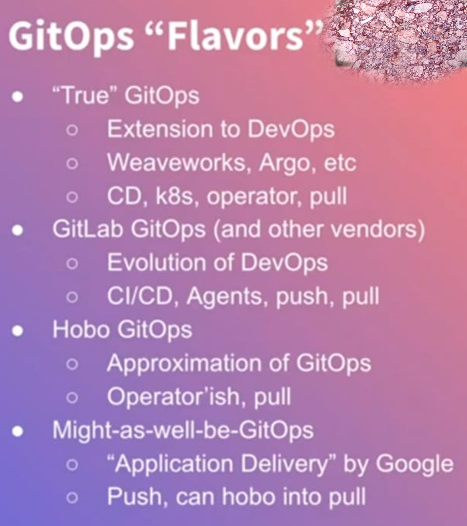
> The three basic components of GitOps are the following:
>> 1. **Infrastructure as Code (IaC)**, a methodology that stores all infrastructure configuration as code.
>> 1. **Merge Requests (MRs)** to serve as a change mechanism for infrastructure updates.
>> 1. **Continuous Integration/Continuous Delivery (CI/CD)** that automates building, testing, and deploying applications, and services.

## Gitops Principles
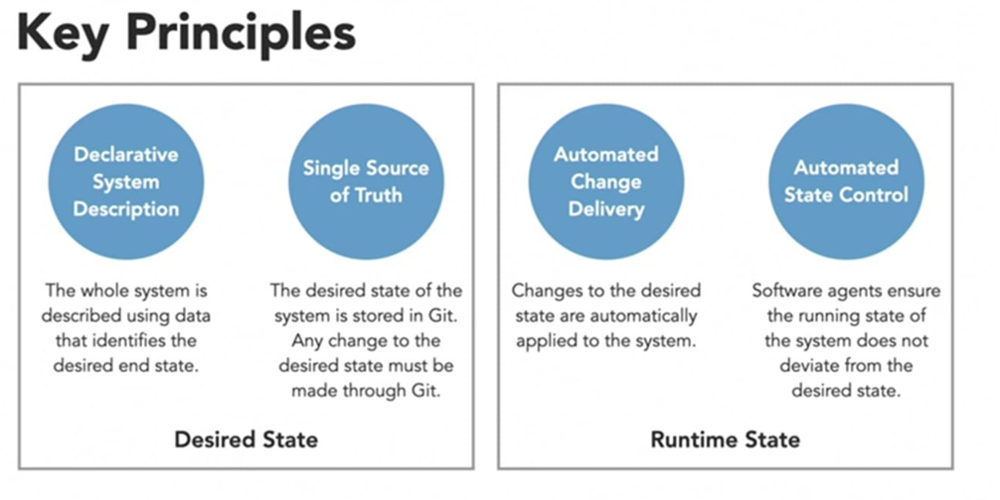
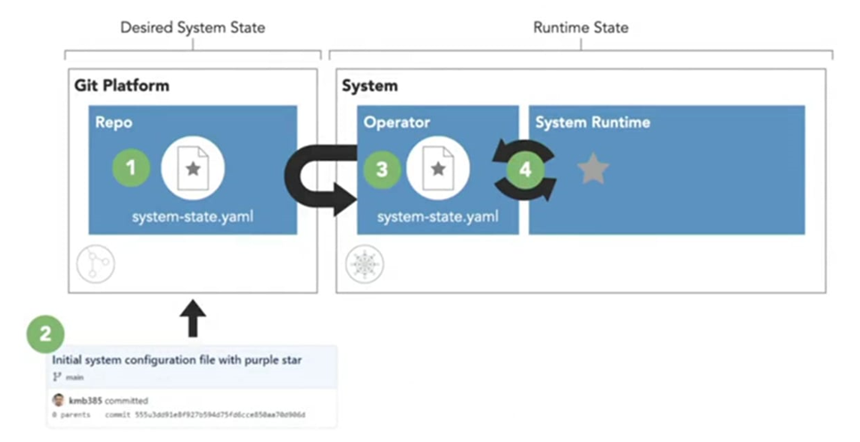
1. Describe the state of the system declaratively.
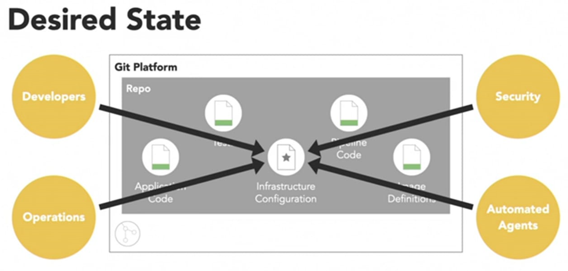
2. Store the system's desired state in git.
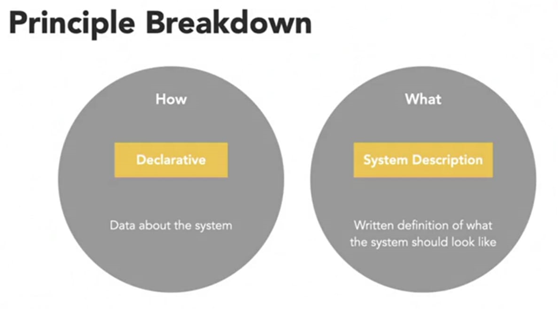
3. Change the system desired state using git commit and automation. No manual changes are present in Gitops.
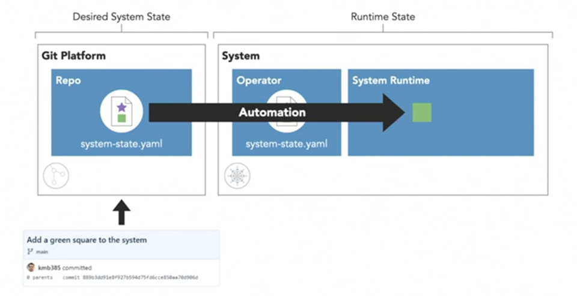
4. An Operator within the system ensures an drift is automatically corrected.
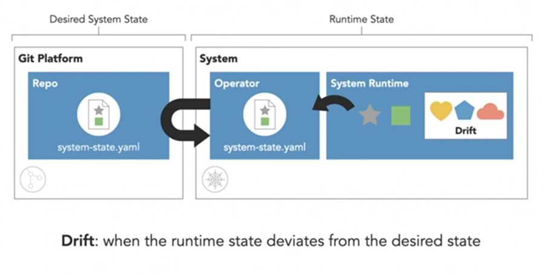

## GitOps vs. DevOps

- GitOps borrows best practices from DevOps and applies them to infrastructure automation. 
- This includes version control, collaboration, compliance, and CI/CD. 
- Tools like Kubernetes have helped automate the software development lifecycle. Because so many businesses use container deployment to scale applications and services, they often depend upon third-party, cloud-based services to host their infrastructure. This has led to the rise of infrastructure automation to achieve a level of elasticity not possible with traditional infrastructure.
- `DevOps` assists in the automation of the software development lifecycle, while `GitOps` contributes to the automation of infrastructure. 

- There are a few key differences between GitOps and DevOps. 
- First, GitOps uses Git to manage infrastructure provisioning and software deployment. DevOps, on the other hand, focuses primarily on CI/CD and does not focus on any one tool. 
- The primary focus of GitOps is to ensure that DevOps is done correctly, whereas DevOps focuses less on correctness. 
- GitOps is also less flexible than DevOps. It is also much easier to adopt GitOps in a business that already employs DevOps.

##  GitOps and Kubernetes
- GitOps focuses on automating infrastructure, so it’s a perfect workflow for businesses that employ Kubernetes. 

> When you employ GitOps and Kubernetes:
>> 1. GitOps ensures everything operates as it was intended.
>> 1. Kubernetes ensures stability and availability.

- Kubernetes always makes sure a deployed application or service remains in a **stable state and scales as needed**.
- When GitOps is along for the ride, it ensures everything runs as it should, including the infrastructure necessary for the deployments. 
- GitOps serves as the glue between application build/delivery (Kubernetes) and where the application is to run.

## Traditional vs GitOps
- Common pattern used by organizations is the **CIOps**. 
> 1. In this pattern, a change is made to the application in the source repository. This triggers the build system.
> 1. The CI pipeline builds the software and executes tests against it and packages it into a container image and is stored in a container registry.
> 1. CI pipeline then triggeres the CD pipeline which has permission to make calls against the K8s API. This the point where the security concern is raised.
> 1. Once the cluster state is updated in ETCD, the cluster begins to materialize the desired state by pulling the built image from the container registry and deploying it against the nodes.
- If the application change is not correct, it is difficult to recover from a bad deployment as the state is updated and the cluster has become unstable.
 
> Disadvantages of CIOps
>> 1. There is little separation between CI and CD system as it could be the same tool. Its like forcing the CI tool to do continuous delivery which it was not supposed to do.
>> 1. CI tool needs priviledges to make K8s API calls to perform deployments. It violates the trust boundary and can allow an attacker to use a compromised pipeline to execute a malicious code.
>> 1. Its not stable as success or failure of deployments is unknown. This is true in case a deployment fails and leaves the cluster in an unstable state.
>> 1. Not a feasible option for multiple clusters or a single large cluster.

- Gitops pattern
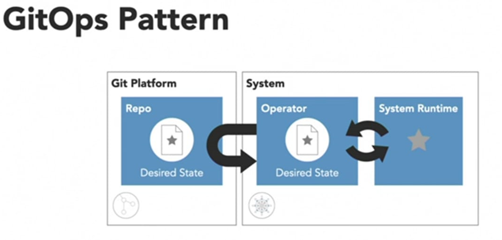
> First store the desired state declaratively in git.
> Pull the desired state into the system using an operator.
> Use a control loop to keep all of this in sync. 

> 1. It keeps the CI pipeline intact from CIOps except for removing the trigger for the CD pipeline.
> 1. Under Gitops, the sole responsiblity of CI is to produce an artifact, in this case its a container image that is placed within an artifact repository.
> 1. The Operator takes over from CI. It monitors the desired state in git for any changes which are made to a separate `Environment` repo which are made using `pull requests`.
> 1. Once operator detects a change to the K8s manifest in the repo and provides this to the K8s control plane using the API to update the new state of the cluster.
> 1. This causes the cluster to pull the new image and deploys it across the nodes.  

## Gitops Usecases
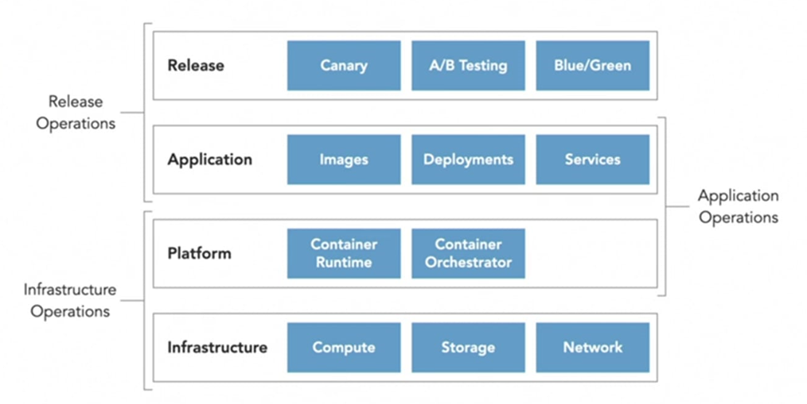
1. **Infrastructure Operations**: Gitops expects resources can be rapidly deployed using Cloud services. Teams use tools like Trraform to declare the infrastructure in manifest to create K8s cluster in a particular region.
2. **Application Operations**: Flux is used to ensure applications are deployed in an automated fashion to a K8s cluster
3. **Release Operations**: GitOps practises can be applied to declaratively define complex release strategies like Canary or Blue green deployments. Tools like Flagger fall into this space.  

## The GitOps Workflow
- The traditional application lifecycle resembles the following:
```
Design --> Build --> Image --> Test --> Deploy
```
- When you add GitOps into the mix, that lifecycle looks as follows:
```
Design --> Build --> Image --> Test --> Monitor --> Log changes/events --> Alert when a change has occurred --> Update
```
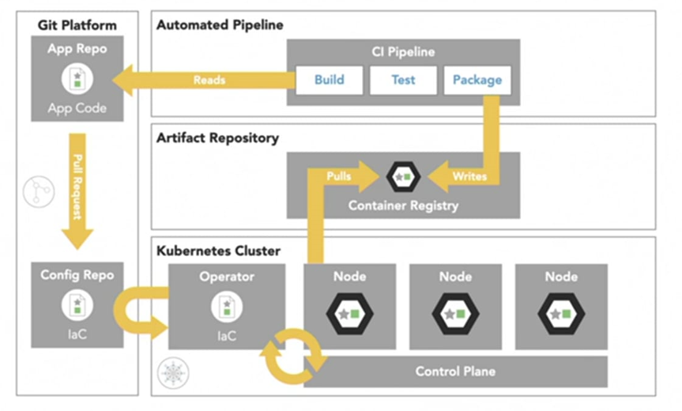
- With a **Kubernetes workflow** as your source of truth all necessary code is stored in a Git repository with the help of automation. 
- Anyone with Kubernetes management rights can create pull requests, edit code, and issue merge requests to the repository. 
- Once a merge request is complete, the automated GitOps operator detects the changes, another automator declares if the change is operational, and the change is automatically deployed to the cluster.
- Within the GitOps workflow you not only have a high level of automation, but there’s also a much higher probability that every deployment works exactly as expected.
- Using Flux as the gitops operator within Kubernetes.
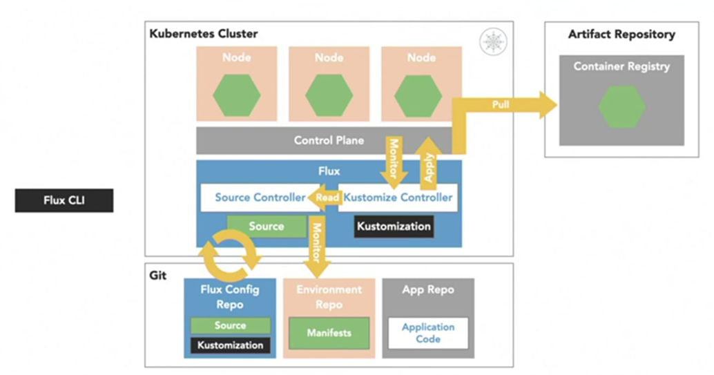
- Using Flux and Flagger together to bring in Progressive or Blue-Green Deployment strategies.
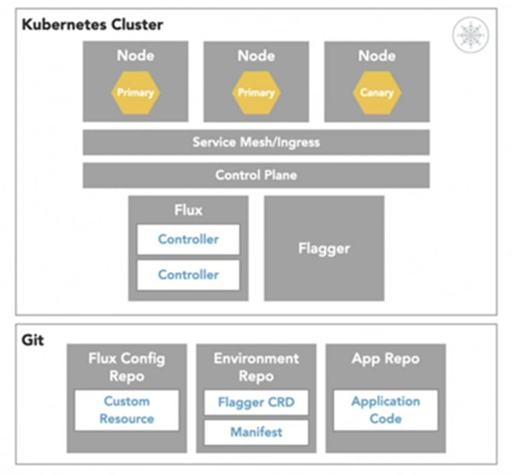

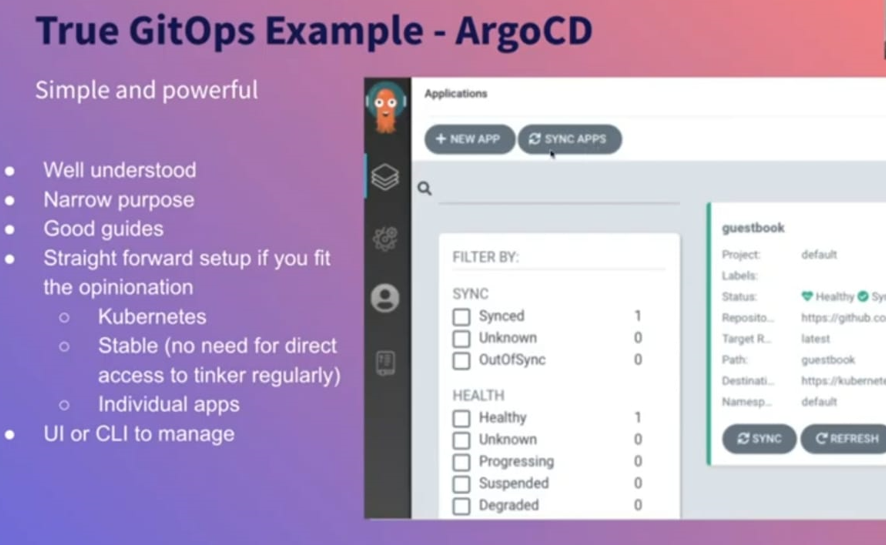


- An alternate workflow created by Gitlab
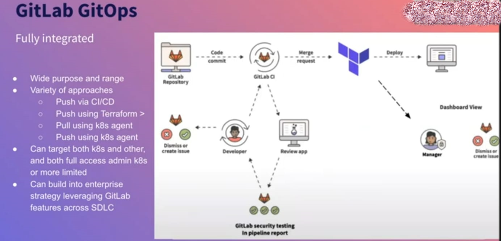
 
> Advantages of GitOps
>> 1. CI and CD are decoupled into separate concerns.
>> 1. CI pipeline is left intact. However the CD pipeline is shifted inside the cluster where an **Operator** is responsible for automating deployment of changes to ensure it matches the desired state found in git.
>> 1. This eliminates the potential security concerns associated with the traditional push model from CIOps.
>> 1. It also provides recoverabilty as the cluster can be quickly rebuilt from source code.


## GitOps Tools
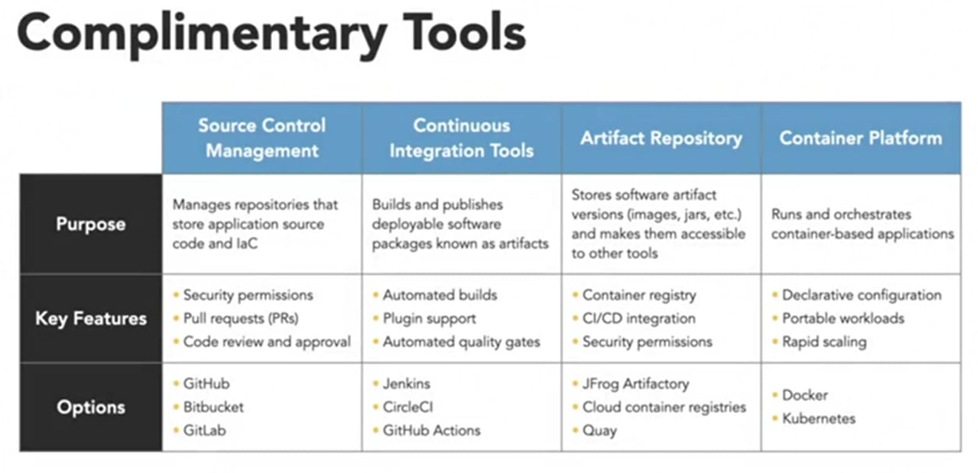
There are several tools useful to GitOps, some of those tools include:

1. **Git** - a version control system.
1. **GitHub** - a code repository for housing your code.
1. **Cloud Build** - a service that executes the build step of your deployment lifecycle using pre-packaged docker containers that include all of the appropriate tooling.
1. **CircleCI** - a SaaS-style build engine that simplifies the build steps and can serve as a CI/CD engine.
1. **Kubernetes** - a container orchestration platform that can be seamlessly integrated with GitOps.
1. **Helm** - a robust tool for configuring Kubernetes resources.
1. **Flux** - the GitOps operator for Kubernetes which automatically adjusts the Kubernetes cluster configuration based on the configurations found in your Git repo.
1. **Flagger** - automates the detection of errors in code and prevents those errors from being deployed.
1. **Prometheus** - a powerful GitOps monitoring tool that can generate alerts that are detected by Flagger.
1. **Quay** - an application registry and container image manager.
