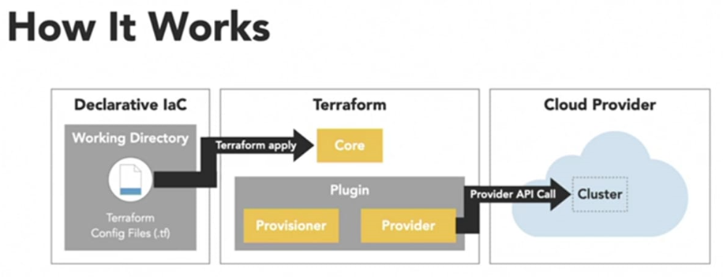

# Cloud Computing Models
## IaaS
- IaaS is a mature computing model that first became popular about a decade ago.  It is currently the most common cloud computing paradigm.
- IaaS cloud providers, offer IaaS services from their extensive pool of physical servers in their data centers. These vendors use a `hypervisor`, also known as a `Virtual Machine Monitor (VMM)`, to create the virtual service. A `hypervisor` is a type of emulator that runs on an actual hardware host, which is referred to as the host machine. It runs a Virtual Machine (VM) that mimics an actual server or network. Some common types of hypervisors include Xen, Oracle VirtualBox, Oracle VM, KVM, and VMware ESX.
- The most common way of creating an IaaS VM is by using cloud orchestration technologies. These  programs choose a hypervisor to run the VM on and then create the virtual machine. They also frequently allocate storage and add firewalls, logging services, and networking essentials including IP addresses. Advanced services might include clustering, encryption, billing, load balancing, and more complicated Virtual Local Area Networks (VLAN). A Virtual Private Cloud (VPC) can assist in further isolating the cloud resources. Both Central Processing Unit (CPU) and Graphics Processing Unit (GPU) systems are typically available.
- Customers of IaaS access their virtualized infrastructure over the internet. They use a visual dashboard or Graphical User Interface (GUI) to quickly create or modify devices, often with the push of a button. The dashboard can also be used to monitor performance, collect data, troubleshoot, and track costs. All services are provided on a pay-as-you-go model. 
- Services can also be provisioned programmatically using APIs. This technique is often used together with `Infrastructure as Code (IaC)` technologies, which deploys the infrastructure using scripts. IaC allows users to standardize common infrastructure tasks and test their deployments using automation.
- One **important point** about IaaS is the customer does not control the underlying physical hardware components and interconnections. These remain under the control of the cloud provider. Users of IaaS are **typically responsible for the selection and installation of the operating system and all software applications, including databases and middleware**.

## PaaS
- PaaS extends the IaaS model **to include operating systems, web servers, tools, databases, and other managed services** that is handled by the cloud providers. 
- The PaaS user is still **responsible for adding and managing applications on top of the vendor-provided platform**. This makes deployment even easier at the cost of some flexibility. 
-  PaaS services are often used for **software and application development**.

## SaaS
- SaaS provides **software services to customers on demand**. 
- Users access the software on the provider’s server, typically through a web browser. 
- SaaS clients are **only responsible for configuring the application, maintaining an access control list, and the actual content**. 
- SaaS is usually geared towards a completely different audience. Most SaaS clients do not require a platform and do not need IaaS capabilities.

## Serverless
- Serverless computing **eliminates the need to manage your infrastructure**.
- It **lies somewhere between PaaS and SaaS** in term of the control/ease-of-use it provides, but is not exactly like either model. 
- The name `“serverless”` is somewhat misleading. Servers are being used, but the end-user has no knowledge or visibility of them. 
- Serverless computing provisions all resources on-demand, and automatically and dynamically scales them up and down in close to real-time. This makes more efficient use of computer resources because the provider allocates the memory, CPU, and networking resources based on the calculated demand. 
- Serverless computing is well suited to a microservices model and is frequently used in software development. However, it can add more latency, and cold starts can affect the system’s performance.

## Conatiners
- Containers, such as Docker, are another option for implementing virtualization, but they follow a completely different model. 
- Containers do not use hypervisors. They run on a Linux partition directly on the hardware. 
- Containers could be said to offer operating-system-level virtualization. 
- Containers offer better performance than hypervisor-based servers at the cost of some additional complexity and have become increasingly popular.

# Reasons to Use IaaS
- The IaaS model is particularly well suited to the following scenarios.

1. **Backup and recovery**: IaaS services are handy for backing up applications and data, and for rapid recovery systems for on-site networks. In this case, the IaaS network typically mirrors the configuration of the on-site servers.
1. **Testing and rapid development**: IaaS allows for quick prototyping and efficient automated testing. Servers can be created and deleted as required. IaaS facilitates the testing of an application on different platforms and networks. It is also useful for temporary or experimental workflows.
1. **Legal and compliance requirements**: IaaS systems are a good choice for data retention and other record-keeping requirements.
1. **High-performance and specialized computing**: The cost of buying high-performance equipment capable of specialized tasks might otherwise be prohibitive for smaller businesses. IaaS enables smaller businesses to access advanced systems capable of handling data analysis, computer modeling, and 3-D graphics.
1. **Managing unpredictable demand**: The ability to scale up and down means IaaS is a good choice for unpredictable scenarios when the demand is unknown or might vary dramatically. It allows companies to handle unexpected surges.
1. **Rapid migration to the cloud**: IaaS APIs allow for the easy translation of the original network and configuration into IaaS specifications.
1. **Application and web development**: IaaS is also frequently used for web hosting.

# Advantages and Disadvantages
> Advantages:
>> 1. It reduces maintenance, operating costs, and lab space. IaaS allows businesses to focus on their core activities instead of running a on-premises servers.
>> 1. It eliminates the need for capital expenditures on equipment. The pay-as-you-go operating expense of IaaS is easier to budget for than large capital expenditures.
>> 1. IaaS networks can react rapidly to changing business demands, by quickly expanding or contracting. New services are easily created, and customers only use and pay for what they need.
>> 1. IaaS elegantly handles system backups and redundancy and increases reliability. For example, cloud providers have multiple labs and are hardened against failures.
>> 1. Providers of IaaS offer different packages with different levels of memory and performance. It is easy for a customer to find the right package for their network. Customers can also upgrade or downgrade according to their current situation.
>> 1. IaaS providers have more expertise with hardware and networking technologies and can provide advice and support.
>> 1. Many IaaS vendors have geographically diverse locations. This makes it easier for organizations to position their resources closer to their end-users. It also provides an even greater level of redundancy and protection in the case of local outages or failures.
>> 1. IaaS can provide better security because vendors are more familiar with updated security protocols.

> Disadvantages:
>> 1. The biggest drawback is the relative lack of flexibility and low-level visibility compared to on-premises servers. 
>> 1. Customers cannot deploy a system that their IaaS vendor does not offer, and they cannot control attributes such as IP address blocks and subnets. However, this is usually not a big concern for most deployments.
>> 1. Customers should also be aware that most hypervisors support multiple users, and their performance and throughput could be affected by other customers at times.

# Migration Strategies
- Several options are available to organizations that want to relocate their existing network to use an IaaS model.

1. **Staged**: In a staged migration, certain components of the old network are moved over to IaaS before others. For instance, the database or the data could be moved over first. Meanwhile, the original on-site servers are still used to access the database. This strategy reduces the overall risk of the move.
1. **Re-hosting**: This method is also known as the “lift and shift” strategy. The existing configuration, data, and applications are migrated to an IaaS model without any significant modifications. The new IaaS servers are configured the same way the original physical servers were.
1. **Refactoring**: Refactoring re-engineers the environment from scratch to take advantage of IaaS capabilities. This might involve a more detailed API roll-out using IaC products, closer attention to scalability, and more efficient use of cloud resources. During the move, candidate tasks for automation and streamlining can be identified.
1. **Hybrid**: With this strategy, infrastructure items are moved to IaaS selectively. Some resources might remain on the old network for security, logistical, business, or legal reasons.

# IaaS Deployment Strategies
- Each IaaS deployment is unique, but the following high-level principles generally apply.

1. Understand and be clear about the business requirements and the budget before proceeding with any deployments.
1. Carefully review and understand the policies of the cloud provider and their plans, packages, and products. Be clear about the capabilities of the virtualized infrastructure, including the throughput, storage, and memory/performance of each item.
1. Consider how any existing databases and servers should be migrated using one of the techniques in the Migration Strategies section.
1. Attempt to reduce downtime. Schedule a maintenance window for the migration.
1. Test the new network before live deployment.
1. Consider how much storage and what storage types should be used. The main types of storage are object storage, file storage, and block storage. Object storage has become more popular recently because its distributed architecture fits well with the IaaS model.
1. Consider the resiliency and reliability requirements for the network.
1. If necessary, determine the level of support and the service package that is required.
1. Decide what network metrics are important, and monitor these items during and after the initial deployment. Scrutinize the entire network as a single system and continue to regularly maintain, adjust, and optimize it.

# Terraform vs Ansible
- Both Ansible and Terraform are tools for implementing Infrastructure as Code, although they focus on different components. 
- Ansible is geared towards configuration management whereas Terraform’s strength lies in service and cloud orchestration.  
- There could also be situations where the two tools are best used together. 
- Terraform is a **service orchestration tool** which is optimized for cloud and multi-cloud networks. It ensures an environment is in its desired state, stores this state, and restores the system after it is reloaded. It does not focus on configuration management.
- Ansible is a ** configuration management tool**. It excels in provisioning software and devices, and deploying the applications that run on top of the infrastructure. It operates on a particular device in isolation from the network and ensures it is functioning normally.
- There is some overlap between the tools because Ansible can perform some service orchestration. Its playbooks can be extended to deploy applications in a cloud, and it features modules for most major cloud providers. But it is **not as good at orchestrating services and interconnected, dependent applications**.

## The Main Uses for Terraform
- Terraform is an open source IaC tool that is very straightforward to use. 
- Its **main purpose is to build and scale Cloud services and to manage the state of the network**. 
- Terraform `does not` specialize in software configuration, and does not install and manage software on existing devices. 
- Instead, it is geared towards creating, modifying, and destroying servers and other Cloud resources. 
- This means it is most commonly found in data centers and in **software-defined networking (SDN) environments**. 
- It works effectively with both lower-level elements, including storage and networking devices, and higher-level Software as a Service (SaSS) entries. 
- In terms of state management, it maps the actual resources back to the configuration, stores metadata, and improves network performance.
- Terraform can manage external service providers, including cloud networks, and in-house solutions. 
- It is especially useful for **multi-tier or N-tier applications**, such as web servers that use a database layer. 
- Because Terraform models the dependencies between applications and add-ons, it ensures the database layer is ready before any web servers are launched. 
- Terraform is cloud agnostic, and can manage multiple clouds to increase fault tolerance. 
- A single configuration file can oversee multiple providers and handle cross-cloud dependencies. 
- Terraform is very efficient for demos or other disposable environments due to the ease of creating a network on a cloud provider. 
- It helps manage parallel environments, so it is a good choice for testing, validating bug fixes, and formal acceptance.

## The Main Uses for Ansible
- The **main purpose of Red Hat’s Ansible is IT automation**. 
- Ansible automates software provisioning, configuration management, application deployment, and continuous integration (CI) pipelines. 
- Ansible runs on most Linux distributions, and can provision both Linux and Windows-based devices. 
- The design goals of Ansible are to be minimal, consistent, secure, reliable, and easy to learn. 
- It is straightforward to install, and no special programming skills are necessarily required to use it.
- Ansible handles all types of infrastructure platforms, including bare metal, virtualized devices such as hypervisors, and cloud networks. 
- It integrates well with legacy applications and existing automated scripts, and is designed to manage the complex, multi-faceted facilities found in large businesses. 
- Ansible supports idempotent behavior, which means it can place the node into the same state every time. This is necessary for consistency and standardized behavior.

# IaC
> Infrastructure as Code (IaC) is the management of infrastructure (networks, virtual machines, load balancers, and connection topology) in a descriptive model, using the same versioning as DevOps team uses for source code. 

- IaC can be applied throughout the lifecycle, both on the initial build, as well as throughout the life of the infrastructure. Commonly, these are referred to as **Day 0** and **Day 1** activities. “Day 0” code provisions and configures your initial infrastructure.
- **“Day 0”** code provisions and configures your initial infrastructure. If your infrastructure never changes after the initial build (no OS updates, no patches, no app configurations, etc.) then you may not need tools that support subsequent updates, changes, and expansions.
- **“Day 1”** refers to OS and application configurations you apply after you’ve initially built your infrastructure.
- IaC makes changes idempotent, consistent, repeatable, and predictable. 
- With IaC, we can test the code and review the results before the code is applied to our target environments. Should a result not align to our expectations, we iterate on the code until the results pass our tests and align to our expectations. Following this pattern allows for the outcome to be predicted before the code is applied to a production environment. Once ready for use, we can then apply that code via automation, at scale, ensuring consistency and repeatability in how it is applied.
- Since code is checked into version control systems such as GitHub, GitLab, BitBucket, etc., it is possible to review how the infrastructure evolves over time. The idempotent characteristic provided by IaC tools ensures that, even if the same code is applied multiple times, the result remains the same.

> Steps to Define your Infrastructure
>> 1. **Scope**: Identify the Infrastructure for your project.
>> 1. **Author**: Write configuration to define your infrastructure.
>> 1. **Initialize**: Install the required Terraform providers.
>> 1. **Plan**: Preview the changes Terraform will make.
>> 1. **Apply**: Make the changes to your infrastructure.

> Using **Terraform** has several advantages over manually managing your infrastructure:
>> Terraform can manage infrastructure on multiple cloud platforms.
>> The human-readable configuration language helps you write infrastructure code quickly.
>> Terraform's state allows you to track resource changes throughout your deployments.
>> You can commit your configurations to version control to safely collaborate on infrastructure.

- The terraform {} block contains Terraform settings, including the required providers Terraform will use to provision your infrastructure. 
- A provider is a plugin that Terraform uses to create and manage your resources.
- Use resource blocks to define components of your infrastructure. A resource might be a physical or virtual component such as an EC2 instance, or it can be a logical resource such as a Heroku application.
- Resource blocks have two strings before the block: the resource type and the resource name. 
