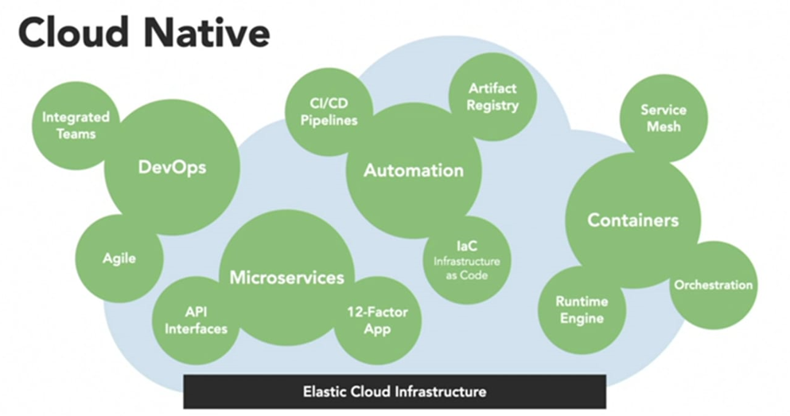

- [Devops Origin](https://devops.com/the-origins-of-devops-whats-in-a-name/)
- [Devops Metrics](https://accelerate.delivery/blog/delivery-metrics/)
- [Trunk based Development behind Feature Flags](https://accelerate.delivery/blog/trunk-development-feature-flags/)
- [Feature Flag Platform](https://launchdarkly.com/)

# Cloud Native Paradigm

1. Devops: (How to Build)
- It assumes you have embraced `Agile` ways of working and have broken down silos in your organization that allow `teams` to work in harmony to deliver software.
-  From a practise perspective, you have `abandoned waterfall`, work in short cycles and are hyper focused on delivering software quickly.
2. Microservices: (What to Build)
- Cloud Native approaches advocate for buidling applications with a `microservices architecture`. You aim to build systems that are modular, service based and lossely coupled.
- This can be achieved by directing integrations through `API interfaces` and by applying design principles similar to those defined by the `12-Factor App` model.
- In general, cloud native applications are made of small services that can be developed and released independently.
3. Automation: (How to Deploy)
- Cloud Native apps rely heavily on `automation`. 
- The switch to building modular systems with many services makes automated `CI/CD pipelines` more critical for building and packaging software into an artifact.
- After automated tests and quality assurance gates pass, the artifacts are stored in a `repository` where they wait for an `automated agent` to deploy and release them into an `environment`.
- What is released into the system and the system’s configuration is determined `by code` that describes the immutable versions of the infrastructure.
4. Containers: (Where to run)
- Cloud native centers around the idea that you run applications using `containers` on scalable infrastructure.
- `Container runtimes` like Docker allows us run software based on images. An image packages an applications and its environment together which makes the software portable and easier to run in any environment.
- To manage how we scale infrastructure and deploy containerized applications, the cloud native aproach uses a `container orchestrator` where K8s is the most popular.
- Taking it a step further, `service mesh` can be used if advanced management of our distributed application's security, policies and traffic is required.
5. GitOps: (How to Operate)
- GitOps tells us how to operate cloud native applications.
- GitOps influences how we use `automation` to `deliver`, `deploy` and `orchestrate` running `containers` the most. 

# Why Devops 

> 1. "Firms today experience a much higher velocity of business change. Market opportunities appear or dissolve in months or weeks instead of years." 
> 1. Annual updates are no longer feasible against modern competition. Updates and bug fixes need to be available right away. It isn't just our management that wants to speed up our releases. Management is simply reacting to the demands of our customers. If customers can't get what they want from us, they'll go somewhere else.

- The rules have changed, and organizations around the world are now adapting their approach to software development accordingly. Agile methods and practices don't promise to solve every problem. But they do promise to establish a culture and environment where solutions emerge through collaboration, continual planning and learning, and a desire to ship high quality software more often.

# Devops

> DevOps is a union of people, processes and products to enable continuous delivery of value to our customers

> DevOps is **not**:
>> 1. A methodology
>> 1. A specific piece of software
>> 1. A quick fix for an organization's challenges
>> 1. Just a team or a job title (although these titles are reasonably common in the industry)

- Our goal is to give our customers **value continously**. We do that by working together with a shared set of practices and tools.
> **Devops Practices**
>> 1. **Agile planning**. Together, we'll create a backlog of work that everyone on the team and in management can see. We'll prioritize the items so we know what we need to work on first. The backlog can include user stories, bugs, and any other information that helps us.
>> 1. **Continuous integration (CI)**. We'll automate how we build and test our code. We'll run that every time a team member commits changes to version control.
>> 1. **Continuous delivery (CD)**. CD is how we test, configure, and deploy from a build to a QA or production environment.
>> 1. **Monitoring**. We'll use telemetry to get information about an application's performance and usage patterns. We can use that information to improve as we iterate.

> **Devops Benefits** - Deployment Frequency, Lead Time for Changes, Change Failure Rate, and Time to Restore
>> DevOps helps companies experiment with ways to increase customer adoption and satisfaction. It can lead to better organizational performance, and often to higher profitability and market share.
>> 1. **Deploy more frequently**. Practices such as monitoring, continuous testing, database change management, and integrating security earlier in the software development process help elite performers deploy more frequently, and with greater predictability and security.
>> 1. **Reduce lead time from commit to deploy**. Lead time is the time it takes for a feature to make it to the customer. By working in smaller batches, automating manual processes, and deploying more frequently, elite performers can achieve in hours or days what once took weeks or even months.
>> 1. **Reduce change failure rate**. A new feature that fails in production or that causes other features to break can create a lost opportunity between you and your users. As high-performing teams mature, they reduce their change failure rate over time.
>> 1. **Recover from incidents more quickly**. When incidents do occur, elite performers are able to recover more quickly. Acting on metrics helps elite performers recover more quickly while also deploying more frequently.
- How you implement cloud infrastructure also matters. The cloud improves **software delivery performance**, and teams that adopt essential cloud characteristics are more likely to become elite performers.
- DevOps is a **key reason** many elite performers are able to deliver value to customers, in the form of new features and improvements, more quickly than their competitors.
- In a comparison between elite performers and low performers, elite performers deploy more frequently, more quickly, and with fewer failures. This mindset helps them better adapt to changing market conditions, experiment with new features, and recover from incidents with greater resiliency. DevOps gives you a path to becoming an elite performer.
- Even for elite performers, change happens gradually, often starting with the most immediate challenges or pain points. Adopting DevOps practices takes time.

# Process
## Value stream maps (VSMs)
> The purpose of a VSM is to visually show where in the process a team creates value and where there's waste. The goal, of course, is to arrive at a process that delivers maximum value to the customer with minimum waste. A VSM can help you pinpoint those areas that either don't contribute any value or that actually reduce the value of the product.

> The first step to setting up a DevOps practice is to assess your current process. This means analyzing:
>> 1. Your existing artifacts, such as deployment packages and NuGet, as well as your container repositories.
>> 1. Your existing test management tools.
>> 1. Your existing work management tools.
>> 1. Recommending migration and integration strategies.

- With a VSM, you'll get a sense of where the team fits into the DevOps maturity model. As it turns out, more mature teams typically release faster, with greater confidence, and with fewer bugs than less mature teams.

> Existing Process
>> 1. They use a waterfall approach. Management sets the priorities. Developers write code and hand the build off to QA. QA tests and then hands off to ops for deployment. (Development processes)
>> 1. Waterfall could be acceptable for a small team, but here the goals aren't always clear and they seem to change frequently.
>> 1. Testing is delayed until late in the process. That means it's harder and more expensive to fix bugs and make changes. (Test processes)
>> 1. There's no clear definition of what "done" means. Each team member has their own idea. There's no overall business goal that everyone agrees on.
>> 1. Some code is in a centralized version-control system. Many tools and scripts exist only on network file shares.
>> 1. There are many manual processes. 
    a. Deploy builds to the pre-production servers for more testing.
    b. Often, the pre-production servers are out of sync with the latest patches and updates that are needed to run the website.
    c. Deploying to pre-production doesn't add value, it's necessary 
>> 1. Communication is haphazard and depends on email, Word docs, and spreadsheets.
>> 1. Feedback is also infrequent and inconsistent.

- **Total lead time** is the time it takes for a feature to make it to the customer. 
- **Process time** is the time spent on a feature that has value to the customer. Here, the process time includes four days for coding plus one day to deploy the feature, which gives a total of five days.
- Activity Ratio (Efficiency) = Process Time / Total lead time
- We want to minimize the time we spend that has no value to the customer. We can really improve our efficiency by adopting a **DevOps approach**. 

## Choose an Agile approach to software development
- Being Agile means learning from experience and continually improving.
- Agile is an **approach** to software development.
- Agile is a term that's used to describe approaches to software development, emphasizing incremental delivery, team collaboration, continual planning, and continual learning. Agile isn't a process as much as it is a philosophy or mindset for planning the work that a team will do. It's based on iterative development and helps a team better plan for and react to the inevitable changes that occur in software development. 
- Iterative software development shortens the DevOps lifecycle by executing against work in smaller increments, usually called sprints. Sprints are typically 1-4 weeks long. Agile development is often contrasted with traditional or waterfall development, where larger projects are planned up front and executed against that plan.
- Agile requires both a **Definition of Done** and **explicit value delivered** to customers in every sprint. 

> Agile Manifesto
>> We value:
>>> 1. Individuals and interactions over processes and tools
>>> 1. Working software over comprehensive documentation
>>> 1. Customer collaboration over contract negotiation
>>> 1. Responding to change over following a plan

- Example of Agile Mindset
1. A team delivers value to the customer, gets feedback, and then modifies their backlog based on that feedback.
2. They learn that their automated builds are missing key tests and include work in their next sprint to address it.
3. They find that certain features perform poorly in production and make plans to improve performance.
4. Someone on the team hears of a new practice and the team decides to try it out for a few sprints.

> Recommendations for adopting Agile
>> 1. Create an organizational structure that supports Agile practices.
>>> Vertical teams span the architecture and are aligned with product outcomes. 
>> 2. Mentor team members on Agile techniques and practices.
>> Train team members in Agile techniques such as how to run stand-up and review meetings. 
>> 3. Enable in-team and cross-team collaboration.
>>> - **Cultural change**. It's important that team members have a quiet, comfortable place to work. They need spaces where they can focus, without a lot of distractions and noise. To give team members more control, meetings need an agenda and strict time frames.
>>> - **Cross-functional teams**. Cross-functional teams add new skills and perspectives that can broaden everyone's ability to solve challenges creatively. Cross-functional teams also make the entire organization more cohesive. They reduce turf wars and increase the sense that everyone is working toward a common goal.
>>> - **Tools for collaboration**. Good tools can help your Agile team members collaborate more effectively, both within the team and with other teams. For example: Teams, Slack, Skype, Google Hangouts, Asana, Trello, GoToMeeting and monday.com. 

> **Scrum** is a framework used by teams to manage their work. Scrum implements the principles of Agile as a concrete set of artifacts, practices, and roles.

> A **sprint** is the amount of time we have to complete our tasks. Sprints help keep us focused. At the end, we can have a short retrospective meeting to share what we've accomplished. After that, we can plan the next one. The product of a sprint is called the increment or **potentially shippable increment**.
- All coding, testing, and quality verification must be done each and every sprint. Unless a team is properly set up, the results can fall short of expectations. 

> Key success factors for Agile development teams:
>> 1. **Diligent backlog refinement**.
An Agile development team works off of a backlog of requirements, often called user stories. The backlog is prioritized so the most important user stories are at the top. The product owner owns the backlog and adds, changes, and reprioritizes user stories based on the customer's needs.
>> 2. **Integrate early and often**.
Continuous integration and continuous delivery (CI/CD) sets your team up for the fast pace of Agile development. As soon as possible, automate the build, test, and deployment pipelines. This should be one of the first things a team sets up when starting a new project. CI/CD forces a team to fix deployment issues as they occur, ensuring the product is always ready to ship.
>> 3. **Minimize technical debt**.
Technical debt includes anything the team must do to deploy production quality code and keep it running in production. Examples are bugs, performance issues, operational issues, accessibility, and others.

- When refining the backlog, there are some key considerations to remember.
1. Refining user stories is often a long-lead activity. 
2. A user story is not refined unless the team says it is. 
3. User stories further down the backlog can remain ambiguous. 

- There are some key CI/CD activities that are critially important to effective Agile development.
1. **Unit testing**. Unit tests are the first defense against human error. Unit tests should be considered part of coding and checked in with the code. Executing unit tests should be part of every build. Failed unit tests mean a failed build.
2. **Build automation**. The build system should automatically pull code and tests directly from source control when builds execute.
3. **Branch and build policies**. Configure branch and build policies to build automatically as the team checks code in to a specific branch.
4. **Deploy to an environment**. Set up a release pipeline that automatically deploys built projects to an environment that mimics production.

- To establish an Agile culture, start by trying to ship the product at the end of every sprint. It won't be easy at first, but when a team attempts it, they quickly discover all the things that should be happening, but aren't.

## Continuous Integration
> Continuous Integration (CI) is the process of automating the build and testing of code every time a team member commits changes to version control. 
-  CI encourages developers to share their code and unit tests by merging their changes into a shared version control repository after every small task completion. 
- Committing code triggers an automated build system to grab the latest code from the shared repository and to build, test, and validate the full main, or trunk, branch.
- Teams can leverage modern version control systems such as Git to create short-lived feature branches to isolate their work. A developer submits a pull request when the feature is complete and, on approval of the pull request, the changes get merged into the main branch.  Then the developer can delete the previous feature branch. Development teams repeat the process for additional work. The team can establish branch policies to ensure the main branch meets desired quality criteria.
> Teams use **build definitions** to ensure that every commit to the main branch triggers the automated build and testing processes. 
> Implementing CI this way ensures bugs are caught earlier in the development cycle, which makes them less expensive to fix. Automated tests run for every build to ensure builds maintain a consistent quality.

> Test Principles
>> 1. **Tests should be written at the lowest level possible**. The majority of tests should run as part of the build, so focus on making that as easy as possible. It's not feasible to test every aspect of a service at this level, but the principle to keep in mind is that heavier functional tests should not be used where lighter unit tests could produce the same results. Consider a parallel build system that can run unit tests for an assembly as soon as that assembly and associated test assembly drop. 
>> 2. **Write once, run anywhere, including the production system**.  It's a best practice for functional tests to only use the public API of the product.
>> 3. **Design the product for testability**. Shifting the balance strongly in favor of unit testing over functional testing requires teams to make design and implementation choices that support testability. The principle to keep clearly in mind is that designing for testability must become a primary part of the discussion about design and code quality.
>> 4. **Test code is product code, and only reliable tests survive**. Apply the same level of care in the design and implementation of tests and test frameworks. Maintain a very high bar for reliability and discourage the use of UI tests as they tend to be unreliable.
>> 5. **Testing infrastructure is a shared service**. Testing should be viewed as a shared service for the entire team. If the tests can be run in every environment from local development through production, then they will have the same reliability as the product code.
>> 6. **Test ownership follows product ownership**. Tests should sit right next to the product code in a repo. If there are components to be tested at that component boundary, don't rely on others to test the component. Push the accountability to the person who is writing the code.

> Shift left
>> The goal for shifting left is to move quality upstream by performing testing tasks earlier in the pipeline. Through a combination of test and process improvements, this both reduces the time it takes for tests to be run, as well as the impact of failures later on. Most importantly, it ensures that most of the testing is completed even before a change is merged into `main`.


## Continuous Delivery
> Continuous Delivery (CD) is the process to build, test, configure, and deploy from a build to a production environment. 
- Multiple testing or staging environments create a Release Pipeline to automate the creation of infrastructure and deployment of a new build. Successive environments support progressively longer-running activities of integration, load, and user acceptance testing.

> Modern release pipelines allow development teams to deploy new features fast and safely. Issues found in production can be remediated quickly by rolling forward with a new deployment. In this way, CD creates a continuous stream of customer value.
- Without CD, software release cycles were previously a bottleneck for application and operation teams. Manual processes led to unreliable releases that produced delays and errors. These teams often relied on handoffs that resulted in issues during release cycles. 
- The automated release pipeline allows a **"fail fast"** approach to validation, where the tests most likely to fail quickly are run first and longer-running tests happen only after the faster ones complete successfully.
- **CD is a lean practice** with the goal to keep production fresh by achieving the shortest path from the availability of new code in version control or new components in package management to deployment.
- By automation, CD minimizes the time to deploy and time to mitigate or time to remediate production incidents (TTM and TTR). In lean terms, this optimizes process time and eliminates idle time.
- CD is helped considerably by the complementary practices of Infrastructure as Code and monitoring.

> Deployment Patterns
1. **Sequential rings**: CD may sequence multiple deployment rings for progressive exposure (also known as "controlling the blast radius"). Progressive exposure groups users who get to try new releases to monitor their experience in rings. The first deployment ring is often a canary used to test new versions in production before a broader rollout. CD automates deployment from one ring to the next and may optionally depend on an approval step, in which a decision maker signs off on the changes electronically. 
- CD may create an auditable record of the approval in order to satisfy regulatory procedures or other control objectives.
- CD also supports two other patterns for progressive exposure beside sequential rings. 
2. **Blue/Green deployment** relies on keeping an existing (blue) version live while a new (green) one is deployed. Typically, this uses load balancing to direct increasing amounts of traffic to the green deployment. If monitoring discovers an incident, traffic can be rerouted to the blue deployment still running. 
3. **Feature flags (or feature toggles)** comprise another technique used for experimentation and dark launches. Feature flags turn features on or off for different end users based on their identity and group membership.

> Key takeaways
>> With the right practices, it's possible to make delivery a productive and painless part of the DevOps cycle.
>> 1. Deploy often
>> 1. Stay green throughout the sprint
>> 1. Use consistent deployment tooling in development, test, and production
>> 1. Use a continuous delivery platform that allows automation and authorization
>> 1. Follow safe deployment practices

> Shift right to test in production
- One of the most effective ways DevOps teams can improve velocity is by shifting their quality goals left. In this sense, they are pushing aspects of testing earlier in the pipeline in order to ultimately reduce the amount of time it takes for new code investments to reach production and operate reliably.
- The full breadth and diversity of the production environment is hard to replicate in a lab. The real workload of customer traffic is also hard to simulate. And even if tests are built and optimized, it becomes a significant responsibility to maintain those profiles and behaviors as the production demand evolves over time.
- Moreover, the production environment keeps changing. It's never constant and, even if your app doesn't change, everything underneath it is constantly changing. The infrastructure it relies on keeps changing. So over a period of time, teams find that certain types of testing just needs to happen in production.
> Testing in production is the practice of using real deployments to validate and measure an application's behavior and performance in the production environment. It serves two important purposes: 
>> 1. It validates the quality of a given production deployment.
>> 1. It validates the health and quality of the constantly changing production environment. 
- To safeguard the production environment, it's necessary to roll out changes in a progressive and controlled manner. This is typically done via the ring model of deployments and with feature flags.
- The first ring should be the smallest size necessary to run the standard integration suite. This is where obvious errors, such as misconfigurations, will be discovered before any customers are impacted.
- Once the initial ring is validated, the next ring can broaden to include a subset of real users. The usage of the new production services by real customers becomes the test run. For example, a bug that prevents a shopper from completing their purchase is very bad, so it would always be better to catch that issue when less than 1% of customers are on that ring, as opposed to a different model where all customers were switched at once.
- If everything looks good so far, the deployment can progress through further rings and tests until it's used by everyone. However, full deployment doesn't mean that testing is over; **tracking telemetry** is crticially important for testing in production. It's arguably the highest quality test data because it's literally the test results of the real customer workload. It tracks failures, exceptions, performance metrics, security events, etc. The telemetry also helps detect anomalies.
- **Fault injection and chaos engineering**. Teams often employ fault injection and chaos engineering to see how a system behaves under failure conditions. 
- This helps to validate that the resiliency mechanisms implemented actually work. It also helps to validate that a failure starting in one subsystem is contained within that subsystem and doesn't cascade to produce a major outage for the entire product. Fault injection also helps create more realistic training drills for live site engineers so that they can be better prepared to deal with real incidents.
- **Fault testing with a circuit breaker**
> A circuit breaker is a mechanism that cuts off a given component from a larger system. 
- Circuit breakers can be intentionally triggered to evaluate two important scenarios:
1. When the circuit breaker opens, does the fallback work? It may work with unit tests, but there's no way to know for sure that it will behave as expected in production without injecting a fault to trigger it.
2. Does the circuit breaker open when it needs to? Does it have the right sensitivity threshold configured? Fault injection may force latency and/or disconnect dependencies in order to observe breaker responsiveness. In addition to evaluating that the right behavior is occurring, it's important to determine whether it happens quickly enough.
- Chaos engineering can be an effective tool, but it should be limited to canary environments. For example, it should only be used against environments that have little or no customer impact.
- It's a good practice to automate fault injection experiments because they are expensive tests and the system is always changing.
## Infrastructure as Code
> Infrastructure as Code (IaC) is the management of infrastructure (networks, virtual machines, load balancers, and connection topology) in a descriptive model, using the same versioning as DevOps team uses for source code. 
>> Like the principle that the same source code generates the same binary, an IaC model generates the same environment every time it is applied. 
- IaC is a key DevOps practice and is used in **conjunction** with continuous delivery.
- Infrastructure as Code evolved to **solve the problem of environment drift** in the release pipeline. 
- Without IaC, teams must maintain the settings of individual deployment environments. Over time, each environment becomes a **snowflake**, that is, a unique configuration that cannot be reproduced automatically. Inconsistency among environments leads to issues during deployments. With snowflakes, administration and maintenance of infrastructure involves manual processes which were hard to track and contributed to errors.
- **Idempotence** is a principle of Infrastructure as Code. 
> Idempotence is the **property** that a deployment command always sets the target environment into the same configuration, regardless of the environment's starting state. 
- Idempotency is achieved by either automatically configuring an existing target or by discarding the existing target and recreating a fresh environment.
> Benefits of IaC
1. Teams who implement IaC can deliver stable environments rapidly and at scale. 
2. Teams avoid manual configuration of environments and enforce consistency by representing the desired state of their environments via code. 
3. Infrastructure deployments with IaC are repeatable and prevent runtime issues caused by configuration drift or missing dependencies. 
4. DevOps teams can work together with a unified set of practices and tools to deliver applications and their supporting infrastructure rapidly, reliably, and at scale.

## Monitoring
> Monitoring provides feedback from production. Monitoring delivers information about an application's performance and usage patterns. **Effective monitoring** is essential to allow DevOps teams to deliver at speed, get feedback from production, and increase customers satisfaction, acquisition and retention.
> One goal of monitoring is to achieve high availability by minimizing key metrics that are measured in terms of time
>> When performance or other issues arise, rich diagnostic data about the issues are fed back to development teams via automated monitoring. That's **time to detect (TTD)**.
>> DevOps teams act on the information to mitigate the issues as quickly as possible so that users are no longer affected. That's **time to mitigate (TTM)**.
>> Resolution times are measured, and teams work to improve over time. After mitigation, teams work on how to remediate problems at root cause so that they do not recur. That's **time to remediate (TTR)**.
> A second goal of monitoring is to enable **validated learning** by tracking usage. The core concept of validated learning is that every deployment is an opportunity to track experimental results that support or diminish the hypotheses that led to the deployment. Tracking usage and differences between versions allows teams to measure the impact of change and drive business decisions. If a hypothesis is diminished, the team can **fail fast or pivot**. If the hypothesis is supported, then the team can **double down or persevere**. These data-informed decisions lead to new hypotheses and prioritization of the backlog.

> **Telemetry** is the mechanism for collecting data from monitoring. 
- Telemetry can use agents that are installed in the deployment environments, an SDK that relies on markers inserted into source code, server logging, or a combination of these. Typically, telemetry will distinguish between the data pipeline optimized for real-time alerting and dashboards and higher-volume data needed for troubleshooting or usage analytics.

> **Synthetic monitoring** uses a consistent set of transactions to assess performance and availability. 
- Synthetic transactions are predictable tests that have the advantage of allowing comparison from release to release in a highly predictable manner. 

> **Real user monitoring (RUM)**, on the other hand, means measurement of experience from the user's browser, mobile device or desktop, and accounts for last mile conditions such as cellular networks, internet routing, and caching. 
- A well-monitored deployment streams the data about its health and performance so that the team can spot production incidents immediately. 
- Combined with a continuous deployment release pipeline, monitoring will detect new anomalies and allow for prompt mitigation. This allows discovery of the **unknown unknowns** in application behavior that cannot be foreseen in pre-production environments.

## DevSecOps
> "Fundamentally, if somebody wants to get in, they're getting in...accept that. What we tell clients is: number one, you're in the fight, whether you thought you were or not. Number two, you almost certainly are penetrated." -- Michael Hayden, Former Director of NSA and CIA

- The mindset shift to a DevSecOps culture includes an important thinking about not only **preventing** breaches, but **assuming** them as well.
```
============================================================
**Preventing breaches**     **Assuming breaches**
------------------------------------------------------------
Threat models	            War game exercises
Code reviews	            Central security monitors
Security testing	        Live site penetration tests
Security development lifecycle (SDL)	
```
- The most important thing to focus on is that practicing techniques that assume breaches helps the team answer questions about their security on their own time, so they don't have to figure it all out during a real security emergency.

> Common questions the team needs to think through:
>> 1. How will we detect an attack?
>> 2. How will respond if there is an attack or penetration?
>> 3. How will we recover from an attack, such as when data has been leaked or tampered with?

> Key DevSecOps practices

1. First, teams should focus on improving their **mean time to detection** and **mean time to recovery**. These are metrics that indicate how long it takes to detect a breach and how long it takes to recover, respectively. They can be tracked through ongoing live site testing of security response plans. When evaluating potential policies, improving these metrics should be an important consideration.
2. Teams should also practice **defense in depth**. When a breach happens, it often results in the attacker getting access to internal networks and everything they have to offer. While it would be ideal to stop them before it gets that far, a policy of assuming breaches would drive teams to minimize their exposure from an attacker who has already gotten in.
3. Finally, teams should perform **periodic post-breach assessments** of the practices and environments. After a breach has been resolved, the team should evaluate the performance of the policies, as well as their own adherence to them. This serves to not only ensure the policies are effective, but also that the team is actually following them. Every breach, whether real or practiced, should be seen as an opportunity to improve.

> Strategies for mitigating threats
-  Some security holes are due to issues in dependencies like operating systems and libraries, so keeping them up-to-date is critical. 
- Others are due to bugs in system code that require careful analysis to find and fix. 
- Poor secret management is the cause of many breaches, as is social engineering. 

> Attack vectors
```
============================================================
**Privilege**	                            **Attack**
------------------------------------------------------------
Can they send emails?	                    Phish colleagues
Can they access other machines?	            Log on, mimikatz, repeat
Can they modify source	                    Inject code
Can they modify the build/release process?	Inject code, run scripts
Can they access a test environment?	        If a production environment takes a dependency on the test environment, exploit it
Can they access the production environment?	So many options...
```
> How can the **blue team** defend against this?
>> 1. Store secrets in protected vaults
>> 1. Remove local admin accounts
>> 1. Restrict SAMR
>> 1. Credential Guard
>> 1. Remove dual-homed servers
>> 1. Separate subscriptions
>> 1. Multi-factor authentication
>> 1. Privileged access workstations
>> 1. Detect with ATP & Azure Security Center

> Secret management
- Use a hierarchy of vaults to eliminate the duplication of secrets. 
- Also consider how and when secrets are accessed. Some are used at deploy-time when building environment configurations, whereas others are accessed at run-time. Deploy-time secrets typically require a new deployment in order to pick up new settings, whereas run-time secrets are accessed when needed and can be updated at any time.

- The **red team** should include some security-minded engineers and developers deeply familiar with the code. It's also helpful to augment the team with a penetration testing specialist, if possible. If there are no specialists in-house, many companies provide this service along with mentoring.
- The **blue team** should be made up of ops-minded engineers who have a deep understanding of the systems and logging available. They have the best chance of detecting and addressing suspicious behavior.
- Expect the red team to be effective in the early war games. They should be able to succeed through fairly simple attacks, such as by finding poorly protected secrets, SQL injection, and successful phishing campaigns. Take plenty of time between rounds to apply fixes and feedback on policies. This will vary by organization, but you don't want to start the next round until everyone is confident that the previous round has been mined for all it's worth.
- After a few rounds, the red team will need to rely on more sophisticated techniques, such as cross-site scripting (XSS), deserialization exploits, and engineering system vulnerabilities. it will also help to bring in additional outside security experts in areas like Active Directory in order to attack more obscure exploits. By this time, the blue team should not only have a hardened platform to defend, but will also make use of comprehensive, centralized logging for post-breach forensics.

> "Defenders think in lists. Attackers think in graphs. As long as this is true, attackers win." -- John Lambert (MSTIC)

- Over time, the red team will take much longer to reach objectives. When they do, it will often requiring discovery and chaining of multiple vulnerabilities to have a limited impact. Through the use of real-time monitoring tools, the blue team should start to catch them in real-time.
- Any security risks or lessons learned should be documented in a backlog of repair items. Teams should define a service level agreement (SLA) for how quickly security risks will be addressed. Severe risks should be addressed as soon as possible, whereas minor issues may have a two-sprint deadline.
> Lessons learned 
>> 1. War games are a really effective way to change DevSecOps culture and keep security top-of-mind.
>> 1. Phishing attacks are very effective for attackers and should not be underestimated. The impact can be contained by limiting production access and requiring two-factor authentication.
>> 1. Control of the engineering system leads to control of everything. Be sure to strictly control access to the build/release agent, queue, pool, and definition.
>> 1. Practice defense in depth to make it harder for attackers. Every boundary they have to breach slows them down and offers another opportunity to catch them.
>> 1. Don't ever cross trust realms. Production should never trust anything in test.